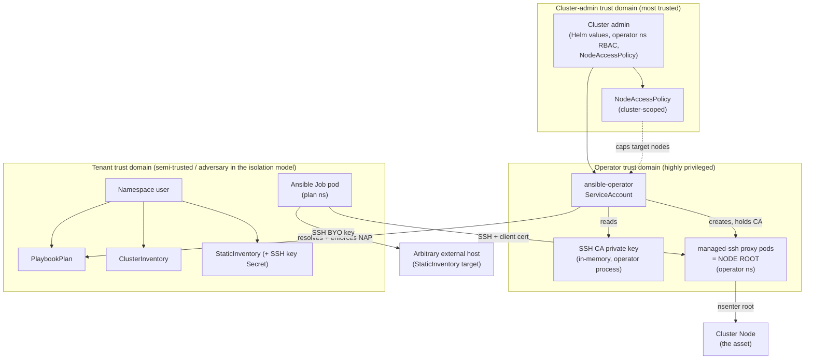

# Threat Model — ansible-operator

> Scope: the `new-arch` managed-ssh execution model. This document describes the
> security architecture, enumerates threats against it, states the invariants the
> design relies on, and records the residual risks and deployment assumptions that
> operators MUST understand before running this in a multi-tenant cluster.
>
> Status: living document. Update it when a trust boundary, RBAC grant, or the
> managed-ssh mechanism changes.

---

## 1. What this system does (and why it is dangerous)

`ansible-operator` runs Ansible playbooks against **cluster nodes** (and arbitrary
external hosts) from inside Kubernetes. A `PlaybookPlan` fans out to one Kubernetes
`Job` per run; for `ClusterInventory`-sourced hosts, the Job connects over SSH to an
ephemeral **managed-ssh proxy pod** the operator schedules onto the target node.

The proxy pod is, by design, a **node-root primitive**:

- `hostPID: true` ([`managed_ssh.rs` `build_pod`](src/v1beta1/controllers/playbookplancontroller/managed_ssh.rs))
- `/proc` bind-mounted from the host (`HostPathVolumeSource` → `/host/proc`)
- `CAP_SYS_ADMIN` + `CAP_SYS_PTRACE`, plus SELinux `spc_t` (the label `oc debug node/…`
  and `privileged: true` pods get)
- every SSH session is wrapped in `nsenter -m/-n/-i/-u` into the host's mount / net /
  ipc / uts namespaces via `/host/proc/1/ns/*`, then `exec sh -c "$SSH_ORIGINAL_COMMAND"`

**Consequence:** anyone who can open an authenticated SSH session to a proxy pod gets a
root shell in the host's namespaces — full control of that node. The entire security
posture of this operator reduces to *who can reach a proxy pod, on which node, with a
valid certificate.* Everything below exists to constrain that.

The operator is therefore a **cluster-privileged component**: compromise of the
operator, its service account, or its CA is equivalent to root on every node it can
schedule onto, plus read/write access to Secrets in its **enrolled** namespaces
(the operator ns ∪ `watchNamespaces` — not the whole cluster; see §8, RBAC).
---

## 2. Assets

| # | Asset | Why it matters |
|---|-------|----------------|
| A1 | **Root on cluster nodes** (via proxy pods) | The ultimate target. Node-root ⇒ container escape, kubelet credential theft, cluster takeover. |
| A2 | **The operator's SSH CA private key** (in-memory only, held in the operator process) | Signs *both* host and client certs. Whoever holds it can mint a client cert with principal `root` and SSH into any proxy pod → A1. Never persisted to the cluster; an operator restart rotates it. No in-process rotation or revocation. |
| A3 | **Per-run client-cert Secret** (`managed-ssh-client-<hash>`, plan ns) | A live credential trusted by every proxy pod of that run. Created in the plan namespace so the Job pod can mount it (pods only mount same-namespace Secrets); owner-referenced to the PlaybookPlan and deleted by name at run completion. |
| A4 | **NodeAccessPolicy resources** (cluster-scoped) | The admin-authored ceiling that decides which namespace may target which nodes. Cluster-scoped, so authoring one needs cluster RBAC. Tampering = privilege escalation to more nodes. |
| A5 | **Tenant Secrets** referenced by PlaybookPlans (vars, files, StaticInventory SSH keys) | Contain credentials the playbook uses; the operator can read Secrets in its enrolled namespaces (operator ns ∪ `watchNamespaces`), not cluster-wide. |
| A6 | **Playbook content & execution integrity** | The playbook runs as root on nodes. Tampering with it = arbitrary node code execution. |
| A7 | **Cluster control plane / node kubelet identities** | Reachable *from* a rooted node (A1); the blast radius of A1. |

---

## 3. Actors and trust boundaries

**Trust boundary crossings that matter:**

- **TB-1 — Tenant → Operator (request → enforcement).** A tenant authors a
  `PlaybookPlan` + `ClusterInventory` requesting nodes. The operator decides whether to
  build node-root infra for those nodes. This is the primary isolation boundary and the
  reason `NodeAccessPolicy` exists.
- **TB-2 — Plan namespace → Operator namespace (network).** The Job pod (tenant ns) must
  reach proxy pods (operator ns). Enforced by a per-run `NetworkPolicy` — *depends on a
  NetworkPolicy-enforcing CNI.*
- **TB-3 — Proxy pod → Node (privilege).** `nsenter` into host namespaces. This boundary
  is *intentionally collapsed* — that is the feature. The controls are all upstream of
  the SSH session (who gets a cert, which node the pod lands on).
- **TB-4 — Admin → Operator (policy authorship).** `NodeAccessPolicy` is cluster-scoped,
  writable only by principals with cluster RBAC (i.e. the admin; the CA is not a Secret — the
  operator mints it in memory). The value of the whole scheme is that policy and request come
  from **independent principals** (see §5, T-ESC-1).

**Design principle (load-bearing):** a check only has teeth when its two sides come from
independent principals. The *request* (ClusterInventory) is tenant-authored; the
*ceiling* (NodeAccessPolicy) is admin-authored; enforcement is a set **intersection** at
resolve time, so it can only ever *shrink* the request. This is why SSH-cert "source
namespace" pinning was rejected — the operator controls both the CA and the proxy sshd,
so any such check is tautological (same trust domain checking itself).

---

## 4. Data flow / attack surface

Numbered entry points where an actor injects data or makes a request:

1. **PlaybookPlan spec** — playbook text (→ runs as root), inventory refs, variables,
   files (`FilesSource::Other` = arbitrary Volume JSON), image, schedule, tolerations,
   TTL. Tenant-controlled.
2. **ClusterInventory spec** — node label selectors → requested nodes. Tenant-controlled.
3. **StaticInventory spec** — literal hostnames/IPs + SSH `SecretRef`. Tenant-controlled.
4. **Referenced Secrets** — variable/file/SSH-key Secrets in the plan namespace.
5. **NodeAccessPolicy spec** — namespaceSelector + nodeSelector. Admin-controlled.
6. **Node & Namespace labels** — consumed by selectors on both sides. Controlled by
   whoever can label nodes/namespaces (normally cluster admin; see T-ESC-3).
7. **Helm values** — proxy image, operator namespace, RBAC. Admin-controlled.
8. **The proxy pod SSH endpoint** — TCP/22, authenticated by client cert. Reachable by
   whatever the NetworkPolicy + CNI allow.
9. **The playbook's own runtime** — executing as root on the node; can reach the control
   plane, kubelet, other workloads on that node.

---

## 5. Threat enumeration (STRIDE)

Each threat: mechanism → current mitigation (grounded in code) → residual risk → severity.
Severity is qualitative for a shared multi-tenant cluster where tenants are semi-trusted.

### Spoofing

**T-SPOOF-1 — Forged SSH client identity to a proxy pod.**
An attacker presents a self-signed key to a proxy pod's sshd.
- *Mitigation:* sshd uses `TrustedUserCAKeys` — only certs signed by the operator CA are
  accepted (`render_sshd_config`; `PasswordAuthentication no`, `KbdInteractiveAuthentication no`).
  Certs are validated cryptographically (`ca.rs` tests confirm a foreign CA fails).
- *Residual:* reduces to "can you obtain a CA-signed client cert" (→ T-ID-1, A2/A3).
- *Severity:* Low in isolation; the real risk is credential reuse, below.

**T-SPOOF-2 — Rogue endpoint impersonating a proxy pod (host-cert spoofing).**
The client trusts host certs via `@cert-authority * <ca_pub>` — a **wildcard** principal
(`ensure_client_cert`). Any CA-signed host cert for any hostname is accepted; targeting
is by pod IP written into the rendered inventory.
- *Mitigation:* pod IPs are assigned by Kubernetes; the CA only signs host certs the
  operator itself generates.
- *Residual:* the wildcard means host identity is **not** cryptographically pinned to a
  specific node — a party able to answer on a proxy pod IP with any CA-signed host cert
  would be trusted. In-cluster IP spoofing is CNI-dependent but generally hard.
- *Severity:* Low–Medium; depends on CNI L2/L3 isolation.

### Tampering

**T-TAMP-1 — Tenant edits inventory after resolution to reach extra nodes.**
- *Mitigation:* `NodeAccessPolicy` is enforced at **every** reconcile (`node_access::enforce`,
  step 0b), against a **live** Node list, before any proxy infra is created. Inventory
  drift is re-clamped each tick (`cleanup_proxy_infra` GCs by hash label regardless of
  drift).
- *Residual:* window between label change and next reconcile; see T-TAMP-3.
- *Severity:* Low.

**T-TAMP-2 — Tampering with the workspace/client-cert Secret to alter what runs.**
- *Mitigation:* Secrets are operator-owned (ownerReferences), rendered server-side; the
  client-cert and var/file volumes mount `0400`, sshd config `0500`. Kubernetes RBAC
  governs who can edit them.
- *Residual:* anyone with `secrets` write in the plan namespace can alter the playbook
  workspace (it lives there) → arbitrary root on the plan's *already-authorized* nodes.
  This is within the tenant's existing authority, not an escalation.
- *Severity:* Low (by design the tenant already commands those nodes).

**T-TAMP-3 — Node relabeled into an allowed pool between reconciles.**
The Node set is fetched **live** in `enforce` (deliberately not cached) specifically so a
node stale-labelled *out* of its pool is not served. But label→effect latency still exists
for the next scheduled reconcile.
- *Residual:* node relabels are rare admin actions; latency is bounded by requeue/watch.
  Accepted trade-off (documented in `node_access.rs`).
- *Severity:* Low.

### Repudiation

**T-REP-1 — No attribution of which principal caused a given node-root session.**
- *Mitigation:* client cert principal carries the execution hash; proxy pods, Secrets,
  Jobs, and NetworkPolicies are labelled with `PLAYBOOKPLAN_HASH`/`_HOST`/`_NAME`.
  `warn!` is emitted when NAP excludes nodes.
- *Residual:* no audit trail ties a proxy-pod session back to a *human*; sshd session
  logging inside the proxy is not persisted; the execution-hash principal is an identity
  *marker* only, not enforced by the proxy. K8s audit logs (if enabled) capture object
  creation but not in-session commands.
- *Severity:* Medium for forensics; consider shipping proxy sshd logs.

### Information disclosure

**T-INFO-1 — Operator's Secret access (scoped to enrolled namespaces).**
Secret access is granted per **enrolled** namespace via a `Role`/`RoleBinding`
(`role.yaml`/`rolebinding.yaml`), **not** cluster-wide — the `ClusterRole` does not mention
`secrets` (nor `jobs`/`pods`). The enrolled set = the operator's own namespace ∪ the chart's
`watchNamespaces`. `jobs: create` and `pods: get,list,watch` are likewise scoped to the enrolled set.
- *Mitigation:* the operator can read/write Secrets and create Jobs only in
  namespaces an admin has explicitly enrolled — enrolment is an intentional "this namespace may drive
  node-root runs" decision, authored in `watchNamespaces` (static Helm/GitOps config, no runtime
  `rolebindings` write by the operator). A plan in a non-enrolled namespace is refused with
  `status.phase = UnauthorizedNamespace` before any Secret/Job call (fail-closed; no "all namespaces"
  escape hatch). Distroless image, no shell.
- *Residual:* within the enrolled namespaces the grant is still broad — operator compromise ⇒
  disclosure of Secrets in *those* namespaces, plus Job-create and Secret-`delete` write primitives
  *there* (the per-run client-cert Secret is created and reaped in the plan namespace, so `delete` is
  granted per enrolled namespace, not just the operator's). Widening `watchNamespaces` widens the
  blast radius accordingly; enrol conservatively.
- *Severity:* **Medium** — compromise discloses Secrets and yields Job-create / Secret-delete
  primitives only within the enrolled namespaces, not cluster-wide; the blast radius is bounded to the
  enrolled namespaces.

**T-INFO-2 — CA private key disclosure.**
- *Mitigation:* the CA is generated in-memory at operator startup and **never persisted** —
  no Secret, nothing in etcd, never logged; only the private→public and signing operations
  are exposed in code (`ca.rs`). An operator restart rotates the CA.
- *Residual:* the attack surface is the running operator process itself — operator RCE or
  a process-memory read obtains A2 ⇒ mint a client cert bearing a live run's hash principal ⇒
  node-root on that run's reachable nodes. `get secret` in the operator namespace and
  etcd-at-rest do not disclose it. No in-process rotation/revocation: a leaked CA can keep
  minting certs for as long as the operator process runs (a restart rotates it).
- *Severity:* **High** — disclosure requires code execution or memory access in the operator
  process; read access to a Secret or to etcd-at-rest does not expose the key.

**T-INFO-3 — Cross-run credential reuse via a shared CA.**
Every proxy pod trusts the *same* CA, so a CA-signed client cert is not, on its own, bound
to a single run.
- *Mitigation (primary, cryptographic):* each proxy pod's sshd is configured with an
  `AuthorizedPrincipalsFile` listing **only its own run's execution hash** (`build_secret`),
  and each run's client cert carries that hash as a principal (`ensure_client_cert`). sshd
  therefore rejects a cert whose hash principal doesn't match the proxy's run — a stray/leaked
  client cert from another run is refused at the cert layer, independent of network reach
  (verified end-to-end against the prod proxy sshd image by `managed_ssh::container_tests`).
- *Mitigation (defense in depth):* `build_network_policy` additionally restricts proxy-pod
  ingress to the Job pod in the plan namespace bearing the matching hash label.
- *Residual:* an attacker who can both reach another run's proxy pod IP **and** obtain that
  run's *own* client cert (A3) is still inside its own run's authorization — no cross-run
  escalation. A leaked client cert authenticates **only** to its own run's proxy pods, and those
  pods (plus the cert Secret) are deleted when the run completes (`cleanup_proxy_infra`); its 2h
  `CERT_VALIDITY` is thus only exploitable while those pods are alive, and deleting them is
  effectively immediate revocation. No other or future proxy accepts that principal.
- *Severity:* **Low** — cross-run reuse requires forging a hash principal (needs the CA
  key, i.e. T-INFO-2), not merely defeating NetworkPolicy. See §7 INV-4.

### Denial of service

**T-DOS-1 — Proxy-pod / Job flooding.**
A tenant creates many PlaybookPlans/hosts → many node-root pods (hostPID, host `/proc`) in
the operator namespace (one Job per run, but **one proxy pod per targeted host**).
- *Mitigation:* per-node Leases for mutual exclusion; Job `backoffLimit: 0`,
  `ttlSecondsAfterFinished` reaping; proxy infra GC'd per run by hash label.
- *Residual:* no per-tenant quota on plan/host count; proxy pods consume node resources on
  the *targeted* nodes; a large fan-out is a resource-exhaustion vector. ResourceQuota /
  LimitRange are not set by the chart.
- *Severity:* Medium.

**T-DOS-2 — Fail-closed lockout.**
NodeAccessPolicy enforcement is **always on**. With no matching policy, managed-ssh plans
resolve to **zero** nodes and silently do nothing.
- *Mitigation:* intentional (default-deny). `warn!` on exclusion; status shows
  `eligibleHosts`.
- *Residual:* an operator upgrading an existing cluster without deploying an allow-all
  policy will see all managed-ssh plans stop. This is a **breaking rollout caveat**, not a
  vuln — see §6.
- *Severity:* Operational, not security.

### Elevation of privilege (the core of this model)

**T-ESC-1 — Tenant targets nodes outside its remit ("business-team reaches admin nodes").**
The motivating threat: a namespace that can create a ClusterInventory could otherwise
target *any* node → node-root anywhere.
- *Mitigation:* `NodeAccessPolicy` intersection at resolve time. The ceiling is
  admin-authored (independent principal); enforcement can only shrink the request;
  fail-closed (`selector_matches_fail_closed`: empty selector matches **nothing**; no
  policy ⇒ zero nodes). Non-managed-ssh (StaticInventory) groups are untouched — they are
  not node-root.
- *Residual:* correctness of `selector_matches_fail_closed` and the enforce/clamp path is
  security-critical (unit-tested in `node_access.rs` + `nodeselector.rs`). See INV-1.
- *Severity:* **Critical if bypassed** — this is the primary tenant-isolation control.

**T-ESC-2 — Bypass NodeAccessPolicy via StaticInventory instead of ClusterInventory.**
StaticInventory targets arbitrary hostnames/IPs with a BYO SSH key and is explicitly
**out of scope** for NAP (it is not node-root; it carries its own credentials).
- *Residual:* a tenant can point a StaticInventory at a node's real sshd IP with a key
  they possess — but that is ordinary SSH the tenant could do anyway; it does **not** grant
  the node-root proxy primitive. Still, it is an unclamped egress/lateral-movement channel
  (playbook connects to arbitrary in-cluster or external IPs from the Job pod). NetworkPolicy
  on Job pods is not applied by this operator.
- *Severity:* Medium (egress/SSRF-style), by design outside NAP.

**T-ESC-3 — Node/Namespace label forgery to widen the ceiling.**
Both selectors match on labels. If a tenant can label a Namespace (e.g. their own) with a
label a permissive policy's namespaceSelector matches, or influence Node labels, they widen
their allow-set.
- *Mitigation:* Node labels are normally admin/kubelet-controlled; the `NodeRestriction`
  admission plugin limits a kubelet to its own node's labels; `kubernetes.io/metadata.name`
  is server-stamped and immutable.
- *Residual:* if tenants can set arbitrary labels on their own Namespace (common) **and**
  a policy's namespaceSelector keys off a forgeable label, they self-select into a scope.
  **Admins should target namespaces by the immutable `kubernetes.io/metadata.name` label**
  (the type docs recommend exactly this) and avoid nodeSelectors keyed on tenant-settable
  node labels.
- *Severity:* Medium–High depending on policy authorship discipline. See R4.

**T-ESC-4 — Playbook escapes to control-plane / other tenants from a rooted node.**
Once root on a node (by design), the playbook can read kubelet certs, other pods'
filesystems, secrets mounted on that node, and reach the API server as the node.
- *Mitigation:* none within this operator — this is the inherent power granted. Node
  affinity *softly* schedules the Job pod off targeted nodes (blast-radius hygiene, not a
  control).
- *Residual:* NAP bounds *which* nodes; it cannot bound what happens *on* an authorized
  node. Targeting a control-plane node ⇒ effective cluster admin.
- *Severity:* **Critical** — treat "authorized to run managed-ssh on node X" as "authorized
  to be root on node X and everything scheduled there." Scope policies accordingly
  (especially control-plane nodes).

**T-ESC-5 — Supply-chain: proxy image compromise.**
The proxy image is pulled into a **node-root** pod.
- *Mitigation:* the image is admin-set via the chart's `managedSsh.proxyImage`, rendered into the
  operator config (`proxy_image`) and consumed when building the proxy pod (`build_pod`); it accepts
  a **digest-pinned** reference, so an operator can point it at a trusted, pinned image.
- *Residual:* the shipped **default** is still `testcontainers/sshd:latest` (`DEFAULT_PROXY_IMAGE`) —
  a mutable third-party tag with no digest pin and no signature verification. An operator who does not
  override it runs that tag in a node-root context; a malicious/hijacked image = node-root on every
  targeted node. Pinning is opt-in, not enforced.
- *Severity:* **High** for the default deployment (unpinned `:latest`); reducible to Low by pinning
  `managedSsh.proxyImage` to a trusted digest. See R5.

**T-ESC-6 — Execution-hash collision affecting security-relevant naming/labels.**
`ExecutionHash` (XxHash3_64, non-cryptographic) keys resource names, the NetworkPolicy
podSelector label, and the client-cert principal.
- *Residual:* a collision (or a tenant crafting inputs to collide) could cause two runs to
  share proxy infra / NetworkPolicy scope **and the same `AuthorizedPrincipalsFile` principal**
  (so they'd authenticate to each other's proxies — INV-4's isolation is hash-keyed). XxHash3 is
  not collision-resistant against an adversary. Impact is bounded (both runs are already
  CA-trusted) but the hash is used in security-relevant scoping, not just caching.
- *Severity:* Low (hard to weaponize today), but note it is **not** a security boundary.

---

## 6. Deployment assumptions & required controls

This design is **only** as strong as the environment it runs in. The following are
**requirements**, not recommendations:

1. **A NetworkPolicy-enforcing CNI is strongly recommended (defense in depth).** Cross-run
   isolation is enforced primarily at the sshd cert layer — each proxy accepts only its own
   run's hash principal via `AuthorizedPrincipalsFile` (T-INFO-3) — so a non-enforcing CNI does
   not collapse it. NetworkPolicy still limits reachability to node-root proxy pods and blocks
   non-cert traffic; keep it on for multi-tenant.
2. **Deploy a `NodeAccessPolicy` for the operator namespace before/at rollout.**
   Enforcement is always-on and fail-closed; absent a policy, managed-ssh plans resolve to
   zero nodes (T-DOS-2). See the `cluster-admins` doc in
   [`examples/v1beta1/node-access-policy.yaml`](examples/v1beta1/node-access-policy.yaml).
3. **Lock down the operator namespace.** It runs the node-root proxy pods and the Tier-0
   operator ServiceAccount, and holds per-run client-cert Secrets (A3). The CA itself does not
   live here (in-memory only, A2), but operator compromise still yields it. Restrict RBAC,
   enable etcd encryption at rest, and treat this namespace as Tier-0.
4. **Author policies against immutable/admin-controlled labels** (`kubernetes.io/metadata.name`
   for namespaces; admin-managed node pool labels), never tenant-settable ones (T-ESC-3).
5. **Restrict who can create ClusterInventory/PlaybookPlan** (e.g. admission policy). NAP
   bounds *which nodes*, but managed-ssh on any authorized node is root on that node (T-ESC-4).
6. **Pin the proxy image** to a digest from a registry you trust, via `managedSsh.proxyImage`
   (the default is an unpinned third-party `:latest` tag) (T-ESC-5).

---

## 7. Security invariants (must not regress)

- **INV-1 — Fail-closed selectors.** `selector_matches_fail_closed` MUST treat an empty
  selector as matching nothing. No matching policy MUST yield zero allowed nodes. (Tests in
  `nodeselector.rs`, `node_access.rs`.)
- **INV-2 — Enforcement is intersection-only.** `enforce` MUST only ever remove hosts from
  managed-ssh groups; it must never add or substitute nodes. StaticInventory/Ssh groups MUST
  pass through untouched.
- **INV-3 — Enforcement runs before proxy infra.** NodeAccessPolicy clamping MUST happen at
  inventory resolve time (step 0b), before any proxy pod/Secret/NetworkPolicy is created,
  and on **every** reconcile (re-clamps drift).
- **INV-4 — Cross-run isolation is enforced at the cert layer, with NetworkPolicy as backup.**
  Each proxy pod's `AuthorizedPrincipalsFile` MUST list **only its own run's execution hash**
  (never `root` or a wildcard); adding `root` there re-opens cross-run cert reuse (T-INFO-3). The
  per-run NetworkPolicy MUST still accompany proxy pods (ingress restricted to the matching Job
  pod; podSelector/hash label wiring on the Job pod template MUST match — job_builder sets the
  template metadata labels) as defense in depth.
- **INV-5 — Node set is authoritative & live.** The allow-set MUST be computed from a live
  Node read in `enforce`, never a possibly-stale cache. (Deliberate; see `node_access.rs`.)
- **INV-6 — CA private key never leaves the operator process** — generated in memory, never
  persisted to a Secret/etcd, and never written to logs, status, workspace Secrets, or the
  execution hash.
- **INV-7 — Proxy pods carry both `PLAYBOOKPLAN_HASH` and `PLAYBOOKPLAN_HOST`** so cleanup's
  label-scoped `delete_collection` cannot sweep the ansible Job pod (which lacks `_HOST`).

Any change touching these paths should re-verify the corresponding unit tests and this list.

---

## 8. Operator privilege summary (blast radius)

From [`clusterrole.yaml`](chart/templates/clusterrole.yaml) (cluster-wide) and
[`role.yaml`](chart/templates/role.yaml) (rendered once per enrolled namespace):

| Resource | Verbs | Scope | Risk note |
|----------|-------|-------|-----------|
| secrets | get,list,watch,create,patch,delete | **enrolled ns only** | Reads/writes Secrets only in enrolled namespaces, not cluster-wide. `delete` reaps the per-run managed-ssh client-cert Secret, created in the plan namespace so the Job pod can mount it. |
| secrets | delete,deletecollection | operator ns | Run cleanup (per-host proxy Secrets). |
| jobs | get,list,watch,create | **enrolled ns only** | One Job per run in the plan ns, not cluster-wide. |
| pods | get,list,watch | **enrolled ns only** | Read termination message, not cluster-wide. |
| pods | create,delete,deletecollection | operator ns | **Creates node-root proxy pods.** |
| networkpolicies | get,list,watch,create,delete,deletecollection | operator ns | Run isolation. |
| leases | full | operator ns | Per-node mutual exclusion. |
| nodes | get,list,watch | cluster-wide | Selector resolution / NAP allow-set (cluster-scoped resource). |
| namespaces | get,list,watch | cluster-wide | namespaceSelector matching (cluster-scoped resource). |
| playbookplans/clusterinventories/staticinventories/nodeaccesspolicies | get,list,watch | cluster-wide | CRDs — read cluster-wide so plans in non-enrolled namespaces are seen and reported. |
| playbookplans/clusterinventories/nodeaccesspolicies (/status) | get,update | cluster-wide | Status writes (incl. `UnauthorizedNamespace`); StaticInventory has no status-writing controller. |

The *enrolled set* = the operator's own namespace (always) ∪ the chart's `watchNamespaces`. The
`secrets`/`jobs`/`pods` grants live in a per-enrolled-namespace `Role`/`RoleBinding`, not the
`ClusterRole` (see [`role.yaml`](chart/templates/role.yaml)).

**Net:** the operator is **Tier-0** for node-root capability *on enrolled namespaces*. Operator
compromise does not imply whole-cluster Secret disclosure or a cluster-wide Job-create/Secret-delete
primitive — the blast radius is bounded to the enrolled namespaces. Node-root reach into only a few enrolled
tenant namespaces is materially smaller than "≈ cluster compromise."

---

## 9. Residual risks & open recommendations

The mitigations described in §5 and §8 are implemented and in place; the items below are the
residual risks that remain open. (R1 — scoping Secret/Job/Pod access to enrolled namespaces — is
fully implemented and carries no open tail; see T-INFO-1 and §8.)

| ID | Recommendation | Addresses | Priority |
|----|----------------|-----------|----------|
| R2 | The CA is rotated only by an operator restart. Consider periodic restarts (or an in-process rotation timer) to bound the window in which a leaked/compromised CA (T-INFO-2) can mint certs. A leaked *client* cert is already bounded by proxy-pod lifetime — principal-scoped, and the pods plus the cert Secret are deleted on completion (`cleanup_proxy_infra`) — so a shorter `CERT_VALIDITY` or a CRL adds little. | T-INFO-2 | Low |
| R3 | Bind the client-cert principal to specific *host(s)*, not just the run, for intra-run host scoping; document the CNI / defense-in-depth posture in the chart `NOTES.txt`. | T-INFO-3 | Low |
| R4 | Ship a linter/validating admission example that rejects NodeAccessPolicies keyed on tenant-settable labels; recommend `kubernetes.io/metadata.name` in docs (already in type docs). | T-ESC-3 | Medium |
| R5 | The proxy image is now admin-overridable and digest-pinnable via `managedSsh.proxyImage`. Still open: ship a **pinned default** (the shipped default is an unpinned `testcontainers/sshd:latest`) and document image-signature/admission verification. | T-ESC-5 | Medium |
| R6 | Persist/ship proxy sshd session logs and emit a structured audit event per node-root session for attribution. | T-REP-1 | Medium |
| R7 | Add per-tenant ResourceQuota/LimitRange guidance and optionally a max-fan-out guard. | T-DOS-1 | Low |
| R8 | Pin host identity: replace the `@cert-authority *` wildcard with per-host known_hosts entries so host certs are bound to the intended node. | T-SPOOF-2 | Low |
| R9 | Consider a cryptographic hash (or explicit run UID) wherever `ExecutionHash` feeds security-relevant naming/labels/principals. | T-ESC-6 | Low |

---

## 10. Out of scope / accepted

- **Root on an authorized node** (T-ESC-4): inherent to the product. NAP bounds *which*
  nodes; on an authorized node the playbook is fully trusted. Scope policies (esp.
  control-plane) as if granting root.
- **A malicious cluster admin**: the admin authors policy and the chart, and controls the
  operator that mints the CA — they are the root of trust, not an adversary in this model.
- **StaticInventory targeting external hosts** with tenant-owned keys: ordinary SSH the
  tenant could perform regardless; outside NAP by design (T-ESC-2), noted as an egress channel.

---

### Appendix A — Certificate model at a glance

- One ephemeral **Ed25519 CA** per operator process — generated in memory at startup
  (`CertificateAuthority::generate` in `main.rs`), never persisted; a restart rotates it.
- Per **proxy pod**: a fresh host keypair, host cert signed for principal `<hostname>`,
  valid 2h. Presented to clients; clients trust via `@cert-authority *`.
- Per **run**: one client keypair, client cert signed for principals `["root", "<hash>"]`,
  valid 2h, trusted by every proxy pod via `TrustedUserCAKeys`. `<hash>` is the *enforced*
  principal (see below); `root` is retained for `PermitRootLogin yes` / the default username check.
- Scoping of a client to "its own" proxies is **cert-level**: each proxy pod's sshd sets
  `AuthorizedPrincipalsFile` to a file containing only that run's `<hash>`, so it accepts only
  this run's client cert. The per-run NetworkPolicy is defense in depth on top — see T-INFO-3 / R3.
- Because the principal is run-scoped and the proxy pods (and the client-cert Secret) are deleted
  on run completion (`cleanup_proxy_infra`), a client cert is inert once its run ends — nothing on
  the cluster will accept it, regardless of the 2h validity remaining.
